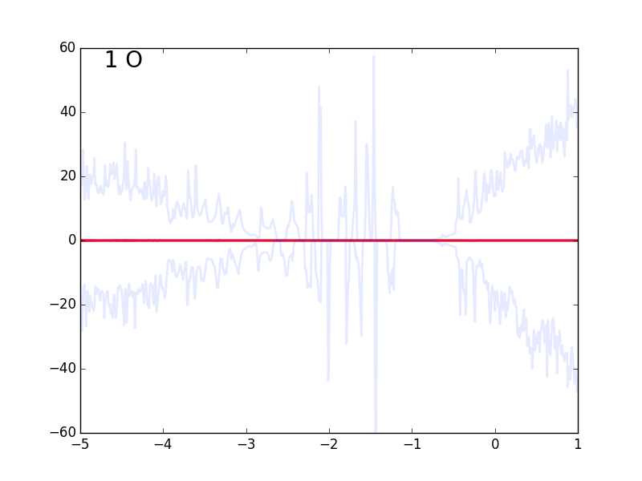

Just a set of scripts to parse/plot data

# TO DO:
 - Merge get_A.py with helping_functions.py

 - Remove all .dat files, link to a folder in which you put them all
 - Remove hardcodings of analysis.py path, just use from astools.analysis import [function]

 
